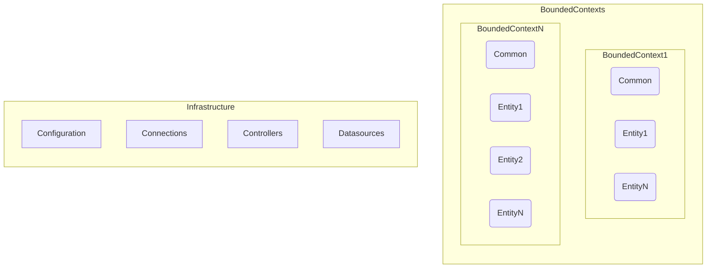

<!-- generated by mermaid compile action - START -->

  
Mermaid markup

<!-- generated by mermaid compile action - END -->

  Esto es un ejemplo, cuando comitead un .md .mermaid :) compila en teoria (mucha teoria)
