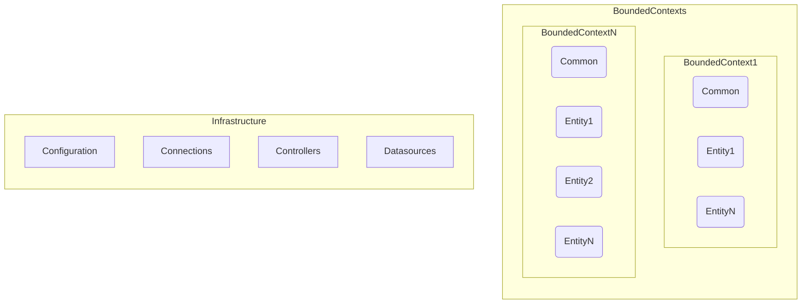

```mermaid
graph BR
        subgraph BoundedContexts
          subgraph BoundedContext1
            Common1(Common)
            entity11(Entity1)
            entity1N(EntityN)
          end

          subgraph BoundedContextN
            CommonN(Common)
            entityN1(Entity1)
            entityN2(Entity2)
            entityNN(EntityN)
          end
        end
        subgraph Infrastructure
          Configuration
          Connections
          Controllers
          Datasources
        end
```

  Esto es un ejemplo, cuando comitead un .md .mermaid :) compila en teoria (mucha teoria)
 prueba
 :D
